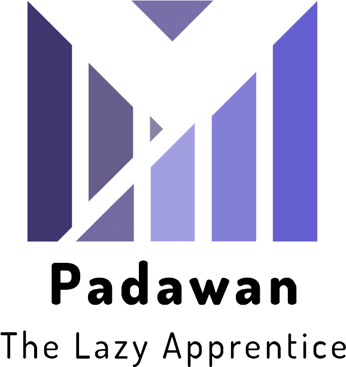

# Padawan

<!-- markdownlint-disable MD033 -->

  

TODO:

- [x] Dont start if folder already exists
- [ ] Generate env.py for django projects
- [ ] - Gitpod support
- [x] Pip install functionality
- [x] Virtualenv install functionality
- [x] Merge IFD and UFCD into "Frontend" folder
- [x] Python folder to be renamed to Backend
- [x] Virtualenv Install Flask
- [x] Virtulaenv install django
- [] - Seperate Django and flask install functions
- [x] Reflect changes to cli menu
- [] - Add JSDoc Comments
- [] - Refactor `createFiles` and `createStructures` to `frontEnd` `backend`

BUGS:

- Virtualenv not working correctly
