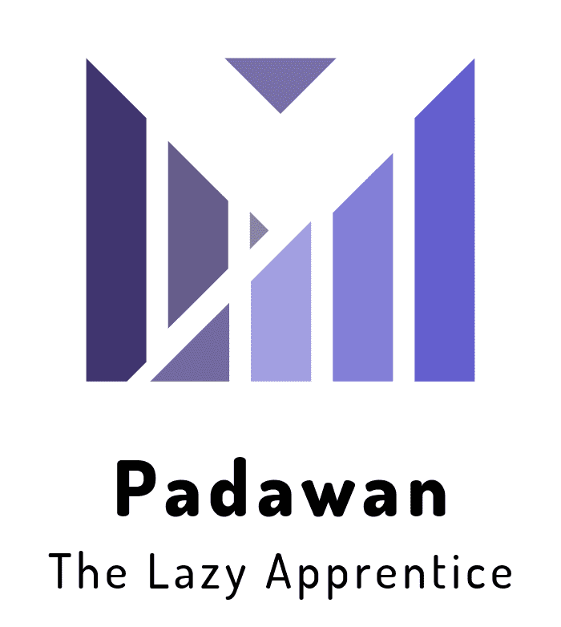

# Padawan

TODO:

- Remove folder if it already exisits
- Generate env.py for django projects
- Pip install functionality
- Virtualenv install functionality
- Gitpod support
- Merge IFD and UFCD into "Frontend" folder
- Python folder to be renamed to Backend
- Remove folders on failure (fs.remove)
- Virtualenv Install Flask
- Virtulaenv install django
